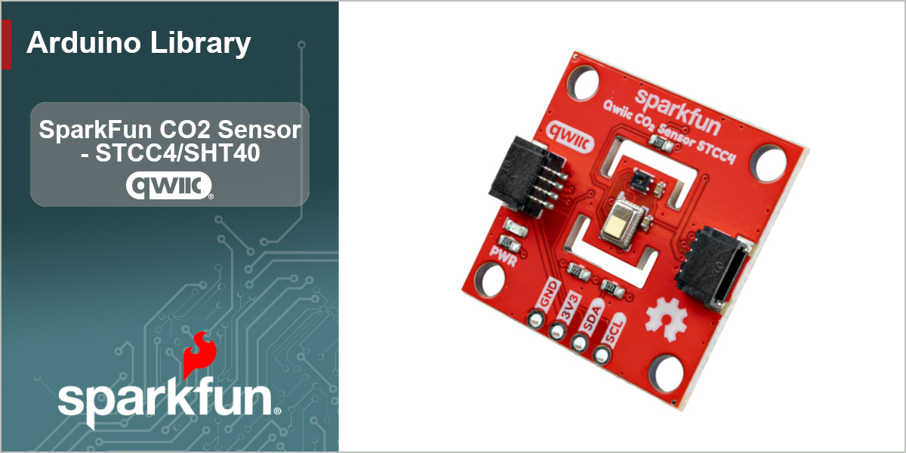

# SparkFun Qwiic CO2 Sensor - STCC4

Arduino Library for the SparkFun Qwiic CO2 Sensor (STCC4)


[](https://github.com/sparkfun/SparkFun_STCC4_Arduino_Library/actions/workflows/test-compile-sketch.yml)


The [SparkFun Qwiic CO2 Sensor - STCC4](https://www.sparkfun.com/) puts Sensirion's miniature STCC4 CO2 sensor on a Qwiic-enabled breakout. The STCC4 measures CO2 concentration from 380 to 32,000 ppm using the thermal conductivity sensing principle, and the board pairs it with a Sensirion SHT40 wired to the STCC4's dedicated sensor interface. The STCC4 reads it autonomously to compensate its CO2 output for ambient humidity and temperature, and passes the readings along to you.

This library provides an easy-to-use interface to the board over I2C, built on the [SparkFun Toolkit](https://github.com/sparkfun/SparkFun_Toolkit). With it you can read CO2 in ppm, temperature in °C or °F, and relative humidity in %RH from a single measurement call.

## Functionality

- CO2 concentration in ppm, with CRC-validated transfers
- Ambient temperature and relative humidity, gathered by the STCC4 from the onboard SHT40
- Fully automatic CO2 compensation
- Continuous measurement mode (1 s interval) and low-power single shot mode
- Sleep / wake control for battery-powered projects (~1 µA in sleep)
- Ambient pressure compensation for operation at altitude
- Forced recalibration (FRC) against a known CO2 reference, plus factory reset
- On-chip self-test, sensor conditioning, and testing mode (pauses self-calibration)
- Product ID and unique serial number readout

## Hardware Connections

The board connects over I2C using the Qwiic connector or PTH headers:

| Device | 7-bit Address | Notes |
| -- | -- | -- |
| STCC4 | `0x64` (default) | `0x65` selectable via the ADDR jumper |

> [!NOTE]
> The onboard SHT40 is wired to the STCC4's dedicated sensor interface pins (SDA_C/SCL_C), not to the main I2C bus — an I2C scan will only show the STCC4. The STCC4 reads the SHT40 by itself and returns its temperature and humidity with every measurement, so there is nothing to configure. Because the STCC4 manages the SHT40, do not call `setRHTCompensation()` with this board; that method exists for custom designs without an SHT4x on the interface pins.

## Using the Library

### Installation

Install through the Arduino Library Manager by searching for **SparkFun STCC4**, or download this repository as a ZIP and add it via *Sketch > Include Library > Add .ZIP Library*. This library depends on the [SparkFun Toolkit](https://github.com/sparkfun/SparkFun_Toolkit), which the Library Manager will offer to install alongside it.

### Getting Started

Declare a sensor object:

```c++
#include <SparkFun_STCC4.h>

SfeSTCC4ArdI2C mySensor;
```

In `setup()`, start I2C, call `begin()`, and start the sensor measuring:

```c++
Wire.begin();

while (mySensor.begin() == false)
{
    Serial.println("STCC4 not connected, check your wiring!");
    delay(1000);
}

mySensor.startContinuousMeasurement();
delay(1000); // first data point is ready after one measurement interval
```

### Reading CO2, Temperature, and Humidity

`readMeasurement()` call fetches everything: the CO2 value (already compensated) plus the ambient temperature and humidity the STCC4 gathered from the onboard SHT40:

```c++
if (mySensor.readMeasurement() == ksfTkErrOk)
{
    Serial.print("CO2 (ppm): ");
    Serial.println(mySensor.getCO2());
    Serial.print("Temperature (C): ");
    Serial.println(mySensor.getTemperature(), 1);
    Serial.print("Humidity (%RH): ");
    Serial.println(mySensor.getHumidity(), 1);
}
```

`readMeasurement()` validates the CRC of every word and automatically retries briefly if the sensor's next data point is not ready yet (its internal interval has a ±150 ms tolerance).

### A Note on Return Values and Error Handling

Most methods return a SparkFun Toolkit error code: `ksfTkErrOk` on success, a negative value on failure. Measured values are then fetched from the cached result with the `get` methods, which lets you tell a real reading apart from a communication failure. The CRC checksum of every data word received from either sensor is validated automatically.

### Low-Power Operation

For battery projects, use single shot mode and let the sensor sleep between readings (about 1 µA):

```c++
mySensor.exitSleepMode();
mySensor.measureSingleShot();   // blocks for the 500 ms measurement
mySensor.readMeasurement();
mySensor.enterSleepMode();
// ... wait 5 to 600 seconds before the next measurement ...
```

Keep the sampling interval between 5 and 600 seconds so the sensor's automatic self-calibration keeps working.

### Pressure Compensation

At altitude (or with a barometer on hand), telling the STCC4 the true ambient pressure improves accuracy. The value persists until power-cycled:

```c++
mySensor.setPressureCompensation(83500); // Pascals - about right for Boulder, CO
```

### Calibration

The STCC4 self-calibrates by assuming it sees fresh air (~400 ppm) at least once per week. To correct the sensor immediately against a known concentration, run it for at least 30 seconds in the reference air, stop measurement, and force a recalibration:

```c++
mySensor.stopContinuousMeasurement();

int16_t correction = 0;
mySensor.performForcedRecalibration(420, correction); // outdoor air ~420 ppm
```

`performFactoryReset()` clears all recalibration and self-calibration history. After more than 3 hours without power, `performConditioning()` is recommended to speed the sensor back to full accuracy.

> [!IMPORTANT]
> `performConditioning()` **blocks for about 22 seconds** while the sensor runs its conditioning profile. The call does not return until it finishes. This is the longest-blocking call in the library, so run it once at startup (not inside `loop()`), and don't mistake the pause for a hang. Start a measurement afterwards.

## Examples

The library ships with a set of examples that build from the basics to more advanced features:

- [Example 01 - Basic Readings](examples/Example01_BasicReadings/Example01_BasicReadings.ino) — CO2, temperature, and humidity once per second
- [Example 02 - Low Power Single Shot](examples/Example02_LowPowerSingleShot/Example02_LowPowerSingleShot.ino) — on-demand measurements with sleep mode in between
- [Example 03 - Product Info](examples/Example03_ProductInfo/Example03_ProductInfo.ino) — product ID and unique serial number
- [Example 04 - Self-test](examples/Example04_SelfTest/Example04_SelfTest.ino) — run and decode the STCC4's on-chip self-test
- [Example 05 - Forced Recalibration](examples/Example05_ForcedRecalibration/Example05_ForcedRecalibration.ino) — calibrate against a known CO2 concentration
- [Example 06 - Pressure Compensation](examples/Example06_PressureCompensation/Example06_PressureCompensation.ino) — improve accuracy at altitude

## Documentation

API documentation is generated with Doxygen and published to GitHub Pages from the `main` branch.

## Products That Use This Library

- [SparkFun Qwiic CO2 Sensor - STCC4](https://www.sparkfun.com/)

## Contributing

If you would like to contribute to this library, please report issues and submit pull requests against the GitHub repository.

## License

This product is open source! Please see [LICENSE.md](LICENSE.md) for more information.

- Your friends at SparkFun
